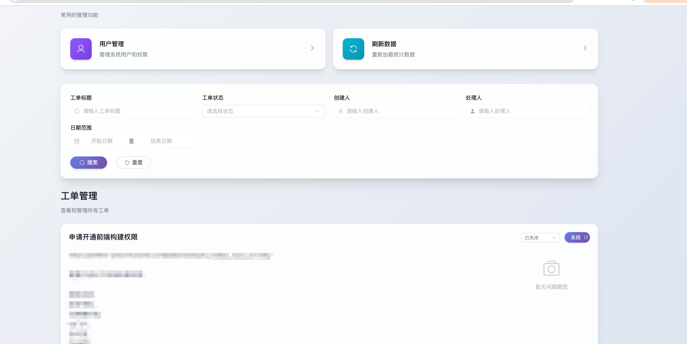
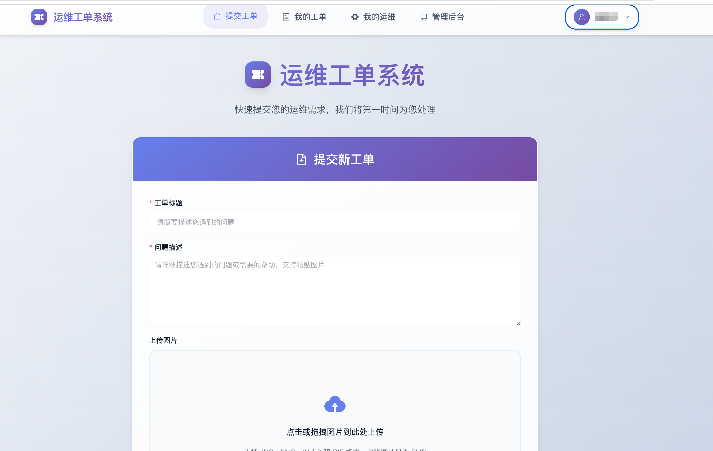

# Lyworder - 运维工单管理系统

> 一个现代化的运维工单管理系统，提供完整的工单生命周期管理，支持图片上传、第三方集成和多角色权限控制。并使用Dify AI和IM进行智能分类、工单分发和消息通知。

## 🎯 项目简介

Lyworder 是一个基于Go语言开发的运维工单管理系统，旨在帮助运维团队高效管理和跟踪用户提交的各类工单。系统提供了直观的Web界面，支持工单创建、状态跟踪、图片附件、自动化通知等完整功能。

## ✨ 主要特性

### 📋 工单管理
- **全生命周期管理**：从创建到解决的完整工单流程
- **状态跟踪**：开放中、已关闭等状态
- **分类标签**：支持工单类型分类

### 👥 多角色权限系统
- **用户角色**：普通用户可提交和查看自己的工单
- **运维角色**：处理工单、更新状态、添加解决方案
- **管理员**：系统管理、用户管理、数据统计

### 📸 图片支持
- **多图上传**：支持选择和粘贴多张图片
- **图片预览**：上传前实时预览
- **缩略图生成**：自动生成缩略图优化加载
- **格式支持**：JPG、PNG、WebP、GIF格式

### 🔗 第三方集成
- **OAuth认证**：集成企业SSO单点登录
- **通知**：工单状态变更自动通知
- **Dify AI**：智能工单分类和分发到对应运维角色
- **Meet API**：企业IM消息推送

## 🛠️ 技术栈

### 后端技术
- **Go 1.23.1**：高性能后端语言
- **Gin Web框架**：轻量级HTTP框架
- **GORM ORM**：数据库操作
- **MySQL 8.0**：主数据库
- **JWT**：用户认证
- **Swagger**：API文档

### 前端技术
- **Vue 3**：现代化前端框架
- **Vite**：快速构建工具
- **Element Plus**：UI组件库
- **Pinia**：状态管理
- **Vue Router**：路由管理

### 部署与运维
- **Docker容器化**：一键部署
- **Nginx**：反向代理

## 🚀 快速开始

### 环境要求
- Go 1.23.1+
- Node.js 16+
- MySQL 8.0+

### 1. 克隆项目
```bash
git clone <repository-url>
cd lyworder
```

### 2. 数据库初始化
```bash
# 创建数据库
mysql -u root -p < init_db.sql

# 或使用Docker
docker run -d \
  --name mysql-ticket \
  -p 3306:3306 \
  -e MYSQL_ROOT_PASSWORD=root \
  -e MYSQL_DATABASE=ticket_system \
  mysql:8.0
```

### 3. 配置文件
```bash
# 复制配置文件模板
cp configs/config.yaml.tmpl configs/config.yaml

# 编辑配置文件
vim configs/config.yaml
```

### 4. 关于oauth2
RedirectURI 配置为 http://localhost:8080/oauth/callback
ClientID 配置为 与你的oauth供应商保持一致
ClientSecret 配置为 与你的oauth供应商保持一致
跳转链接 配置为 http://localhost:8080/login
映射的用户名字段为user_name
映射的用户ID为user_id

### 5. 安装依赖 & 启动

#### 后端服务
```bash
# 安装Go依赖
go mod tidy

# 启动后端服务
go run main.go

# 或使用Docker
make docker-run
```

#### 前端服务
```bash
# 进入前端目录
cd frontend

# 安装前端依赖
npm install

# 部署前端到static目录下
bash deploy.sh
```

### 6. 访问系统
- **主页**: http://localhost:8080
- **API文档**: http://localhost:8080/swagger/index.html
- **管理员账号**: 首次使用时，系统会查询对应JWT的user_name字段，将需要配置为管理员角色的user_name添加到数据库中数据库语句如下：
```sql
INSERT INTO users (ops_type, user_name, role, status)
VALUES ('admin', 'admin', 'admin', 1);
```

## 📊 数据库设计

### 工单表 (tickets)
| 字段名 | 类型 | 描述 |
|--------|------|------|
| id | varchar(20) | 工单ID |
| title | varchar(100) | 工单标题 |
| content | text | 工单内容 |
| status | varchar(20) | 工单状态 |
| user_id | varchar(50) | 用户ID |
| user_name | varchar(100) | 用户名称 |
| operator_name | varchar(255) | 处理人 |
| ticket_type | varchar(255) | 工单类型 |
| screen_shots | json | 截图路径数组 |
| created_at | datetime | 创建时间 |
| updated_at | datetime | 更新时间 |

### 用户表 (users)
| 字段名 | 类型 | 描述 |
|--------|------|------|
| id | int | 用户ID |
| ops_type | varchar(50) | 运维类型 |
| user_name | varchar(100) | 用户名 |
| role | varchar(50) | 用户角色 |
| status | tinyint | 工作状态 |
| created_at | datetime | 创建时间 |
| updated_at | datetime | 更新时间 |

## 🔌 API文档

### 认证接口
- `POST /login` - 用户登录
- `GET /oauth/callback` - OAuth回调
- `POST /logout` - 用户登出

### 工单接口
- `GET /api/v1/tickets` - 获取工单列表
- `GET /api/v1/tickets/detail?id=:id` - 获取工单详情
- `POST /api/v1/tickets` - 创建工单
- `PUT /api/v1/tickets/:id/status` - 更新工单状态
- `PUT /api/v1/tickets/:id/remark` - 添加备注
- `PUT /api/v1/tickets/:id/solution` - 添加解决方案
- `PUT /api/v1/tickets/:id/type` - 更新工单类型

### 用户接口
- `GET /api/v1/users` - 获取当前用户信息
- `GET /api/v1/operator/usersname` - 获取运维人员列表
- `GET /api/v1/operator/users` - 获取所有用户列表
- `POST /api/v1/operator/users` - 创建用户
- `PUT /api/v1/operator/users/info` - 更新用户信息
- `DELETE /api/v1/operator/users` - 删除用户
- `PUT /api/v1/operator/users/status` - 更新用户状态
- `PUT /api/v1/operator/users/type` - 更新用户类型

## ⚙️ 配置说明

### 服务器配置
```yaml
Server:
  Host: http://localhost:8080
  Domain: localhost
  RunMode: debug
  HttpPort: 8080
  ReadTimeout: 60
  WriteTimeout: 60
```

### 数据库配置
```yaml
Database:
  DBType: mysql
  Username: root
  Password: root
  Host: 127.0.0.1:3306
  DBName: ticket_system
  Charset: utf8mb4
```

### OAuth配置
```yaml
Oauth:
  ClientId: "your-client-id"
  ClientSecret: "your-client-secret"
  RedirectURI: "http://localhost:8080/oauth/callback"
  AuthURL: "https://your-oauth-server/auth/oauth/authorize"
  TokenURL: "https://your-oauth-server/auth/oauth/token"
```

### Dify配置
```
Dify:
  APIURL: "https://your-dify-server/v1"
  APIKey: "app-xxxx"
```

### IM配置
```
Meet:
  Host: "https://your-IM-server/im/message/send/"
  RoBotKey: "xxxxxx"
```

## 📱 使用指南

### 用户操作
1. **提交工单**：填写标题、描述，上传图片
2. **查看进度**：实时查看工单处理状态
3. **沟通交流**：在工单下留言与运维沟通

### 运维操作
1. **处理工单**：查看待处理工单
2. **更新状态**：标记处理进度
3. **添加方案**：记录解决方案
4. **通知用户**：状态变更自动通知

### 管理员操作
1. **用户管理**：添加、删除用户
2. **权限配置**：设置用户角色
3. **数据统计**：查看工单统计报表

## 🐛 常见问题

### Q: 图片上传失败？
A: 检查图片格式和大小限制，支持JPG、PNG、WebP、GIF，最大5MB

### Q: 数据库连接失败？
A: 确认MySQL服务运行，检查配置文件中的连接信息

### Q: OAuth登录失败？
A: 检查OAuth配置是否正确，确认回调地址匹配

### Q: 如何添加新用户？
A: 管理员登录后，在用户管理页面添加新用户

### Q: 前端页面无法访问？
A: 确保后端服务已启动，并检查前端开发服务器是否正常运行

## 🔧 开发指南

### 代码规范
- 遵循Go官方代码规范
- 使用gofmt格式化代码
- 添加必要的注释和文档
- Vue组件遵循单文件组件规范

### 性能优化
- 添加合适的索引
- 使用连接池
- 定期清理过期数据
- 前端资源压缩和懒加载

### 监控告警
- 接口响应时间监控
- 错误率监控
- 资源使用率监控

## 🔐 安全建议

### 认证安全
- 使用HTTPS传输
- JWT令牌定期刷新
- 密码强度要求

### 数据安全
- 敏感信息脱敏
- 定期数据备份
- 访问日志记录

### 系统安全
- 及时更新依赖
- 限制文件上传类型
- SQL注入防护

### 系统相关截图




---

<div align="center">
  <sub>Built with ❤️ by lying</sub>
</div>